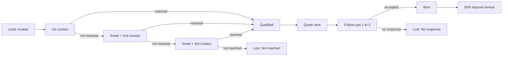

  
  

  
  

 

      

 

 

 

 

I'm an **Odoo technical developer** who turns messy business processes into clean, automated systems. I own projects end to end: understanding the requirement, building custom modules and integrations, deploying, and supporting the live system.

I have worked across **multiple Odoo versions** and **every kind of instance**: **Odoo Online, Odoo.sh, on-premise servers and local environments**. Beyond Odoo, I build with **Python, JavaScript, PHP and React Native**, and I administer **PostgreSQL** databases directly.

I like solutions that fit the problem: native configuration when it's enough, a custom module when it's worth it, and a clear explanation either way.

📍 Karachi, Pakistan &nbsp;·&nbsp; 🗣️ Urdu (native), English (professional) &nbsp;·&nbsp; 💼 Odoo Technical Developer at Bundo Tech

 

 

 

 

 

 

- Started with a month of structured Odoo training, then moved into live client implementation work
- Own client projects end to end: module development and customization, PostgreSQL administration, third-party integrations, and debugging on live production instances
- Work in Git within the development team across all client projects

 

- Built a fully customized Odoo store from scratch that now processes **2,300+ orders**
- Integrated a secure Bitcoin payment gateway with automated order confirmation
- Built an affiliate and referral program: **10+ affiliates** onboarded, automated commission payouts
- Deployed **6 marketing automation campaigns** across a 600+ contact database

 

- Building and customizing website product pages for a grass-cutting robotics company
- Configuring Helpdesk for customer support ticketing and notification workflows, connected to Repair orders

 

- Planning customization and an employee attendance portal
- Accounting customization: payment reconciliation and landed costs; QuickBooks sync
- CRM pipeline automation, lead-to-project workflow, WordPress plugin, React Native apps, website builds

 

 

 

<i>Most work is for private clients, so names and code are withheld. Details are available on request.</i>

 

- Complete Odoo websites built from scratch for two companies, with full Dutch and French translations
- Home, category and product pages with hero products, best sellers, flash sales, brand filters, quantity pricing and detailed specifications
- Fast one-page checkout customized to client requirements, with exact checkout-time capture for campaigns
- Technical SEO (custom meta fields, canonical tags, schema markup) and Google Tag Manager tracking
- Channable product feed module and 80+ customized email templates

 

- BTCPay Server setup for Bitcoin and multiple coins
- Custom payment provider modules for **Rampex** and **PayLio** with API and webhook integrations that sync orders and payments
- Klarna payment method setup

 

- People apply, get approved, and receive an auto-generated password and email
- Portal pages where referrers track their own statistics
- Affiliate dashboard to generate product feeds and special promotion URLs

 

- Campaigns built with Marketing Automation and Email Marketing
- Custom module showing detailed per-campaign statistics

 

- A new lead creates a call task and a calendar block with the request details
- Unreached customers automatically get the right email and a new task on a business-day schedule
- Accepted quotes cancel pending follow-ups; won deals create a deposit invoice and update the calendar

 

- Custom NDA and proposal stages with document attachment fields
- Documents folder created automatically for every lead
- Files sent through the chatter, then forwarded to the linked Project
- Purchase orders raised from projects; lead activities appear in the calendar

 

- Product catalog across 20+ website pages built with the Odoo editor
- Custom flow connecting **Website → Helpdesk → Repair**
- Sales notifications when an order is confirmed

 

- Customer-support ticketing app for complaints and service requests
- Beach-hut booking app covering booking, slot holding and payments

 

- Planning with auto-generated slots and an attendance check-in portal
- Accounting: payment reconciliation and landed costs; QuickBooks sync of orders and payments
- Custom PHP plugin syncing Odoo products to WordPress
- Script extracting data from CVs and certificates into Odoo Contacts
- Websites built with the drag-and-drop editor and from Figma designs

 

 

 

 

| | |
|---|---|
| **Odoo** | Website · eCommerce · Sales · CRM · Planning · Helpdesk · Repair · Accounting · Contacts · Documents · Project · Purchase · Marketing Automation · Email Marketing · Affiliate · Payments · Custom modules · ORM · QWeb reports |
| **Programming** | Python · JavaScript · PHP · React Native · C/C++ · Java · SQL |
| **Integrations** | REST APIs · Webhooks · BTCPay Server · Klarna · QuickBooks · WordPress · Google Tag Manager · Channable |
| **Data** | PostgreSQL · MySQL |
| **Environments** | Odoo Online · Odoo.sh · On-premise · Local · Ngrok tunnels for webhook testing |
| **Tools** | Git · GitHub · VS Code · Figma-to-web |

  
  
  
  
  
  
  
  
  
  

 

 

 

- 🎓 **BS Computer Science**, University of Karachi, Pakistan · Dec 2021 – Dec 2025
- 📘 **HSC, Pre-Engineering**, Govt. Degree College SRE Majeed, Karachi · Sept 2019 – July 2021
- 🗣️ **Languages:** Urdu (native), English (professional working proficiency)

 

 

 

I'm open to <b>full-time Odoo developer roles</b> and <b>freelance projects</b>: integrations, custom modules, websites, automation, deployment and support.

  
  

 

