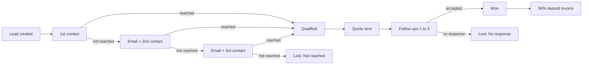

<!-- Header banner -->

  

  
  
  

  
  
  

---

## 👋 About me

I'm an **Odoo developer who owns projects end to end**: from understanding what a business needs, to building custom modules and integrations, to deploying and supporting the live system.

I have worked across **multiple Odoo versions** and **every kind of Odoo instance**: **Odoo Online, Odoo.sh, on-premise servers, and local environments**. Alongside Odoo, I build with **Python, JavaScript, PHP and React Native**, and I manage **PostgreSQL** databases directly.

<table>
  <tr>
    <td align="center"><h2>1,100+</h2>orders processed on a store I built</td>
    <td align="center"><h2>10+</h2>affiliates onboarded with automated payouts</td>
    <td align="center"><h2>600+</h2>contacts reached by 6 automated campaigns</td>
    <td align="center"><h2>80+</h2>email templates customized</td>
  </tr>
</table>

---

## 🛠️ Odoo ERP services

<table>
  <tr>
    <td width="25%" valign="top">
      <h3>🔗 Integration</h3>
      Connect Odoo with payment gateways, QuickBooks, WordPress, marketing tools, and any REST API.
    </td>
    <td width="25%" valign="top">
      <h3>🚀 Implementation</h3>
      Set up Odoo around your real workflows: Sales, CRM, Website, Accounting, Helpdesk, Planning and more.
    </td>
    <td width="25%" valign="top">
      <h3>💻 Development</h3>
      Custom modules, portals, reports, automations, and website features built to your requirements.
    </td>
    <td width="25%" valign="top">
      <h3>📦 Deployment</h3>
      Move your system live, whether on Odoo.sh, on-premise servers, or Odoo Online, with testing along the way.
    </td>
  </tr>
  <tr>
    <td width="25%" valign="top">
      <h3>☁️ Hosting</h3>
      Hosting setup and management across Odoo.sh and on-premise environments, including database administration.
    </td>
    <td width="25%" valign="top">
      <h3>🧰 Support</h3>
      Debugging, fixes, and improvements on live production instances so your team keeps working.
    </td>
    <td width="25%" valign="top">
      <h3>🎓 Training</h3>
      Hands-on training so your team can use Odoo confidently day to day.
    </td>
    <td width="25%" valign="top">
      <h3>🧭 Consulting</h3>
      Advice on the right approach: configuration, custom module, or integration, explained in plain language.
    </td>
  </tr>
</table>

---

## 🧩 What I've built

| | Area | Highlights |
|---|---|---|
| 🛒 | **E-commerce** | Complete websites with hero products, flash sales, brand filters, quantity pricing, fast checkout, Dutch and French translations |
| 🔍 | **Technical SEO** | Custom meta fields, canonical tags, schema markup for products |
| 💳 | **Payments** | BTCPay Server (Bitcoin and multi-coin), Klarna, custom Rampex and PayLio providers with webhooks |
| 🤝 | **Affiliate and referral** | Approval flow, auto-created portal users, stats dashboards, product feeds, tracked links |
| 📈 | **CRM automation** | Multi-stage pipelines, timed tasks, automated follow-up emails, calendar sync |
| 📣 | **Marketing** | Email and Marketing Automation campaigns, custom statistics module, Google Tag Manager |
| 🏭 | **Operations** | Planning, Helpdesk, Repair flows, attendance portals, Documents, Project, Purchase |
| 🧾 | **Accounting** | Payment reconciliation, landed costs, QuickBooks sync |
| 🌐 | **Integrations** | Custom PHP plugin for WordPress, Channable product feeds, REST APIs |
| 📱 | **Mobile** | React Native apps for ticketing and booking, backed by Odoo |

---

## 📂 Selected projects

Most of my work is for private clients, so names and code are withheld. Details are available on request. Click a project to expand it.

<b>🛒 E-commerce platform (Dutch and French)</b> &nbsp;·&nbsp; 1,100+ orders in production

 

Built complete Odoo websites for two companies from scratch.

- Home, category, and product pages with hero products, best sellers, flash sales, brand filters, quantity pricing, and detailed specifications
- Fast one-page checkout customized to client requirements, with exact checkout-time capture for campaign targeting
- Full Dutch and French translations
- Technical SEO with custom meta fields, canonical tags, and schema markup
- Google Tag Manager tracking of page views and button clicks
- Channable product feed module for marketing channels
- 80+ email templates customized across base and custom modules

<b>💳 Payment gateway integrations</b> &nbsp;·&nbsp; Bitcoin, Rampex, PayLio, Klarna

 

- BTCPay Server setup for Bitcoin and multiple coins, with automated order confirmation
- Custom payment provider modules for **Rampex** and **PayLio** with API and webhook integrations that sync orders and payments
- Klarna payment method setup

<b>🤝 Affiliate and referral programs</b> &nbsp;·&nbsp; 10+ affiliates, automated payouts

 

- Referral program where people apply, get approved, and receive an auto-generated password and email
- Portal pages where referrers track their own statistics
- Affiliate management integration with a portal dashboard to generate product feeds and special promotion URLs

<b>📣 Marketing automation</b> &nbsp;·&nbsp; 6 campaigns, 600+ contacts

 

- Campaigns built with Marketing Automation and Email Marketing
- Custom module showing detailed per-campaign statistics

<b>📈 Fully automated CRM pipeline (event studio)</b>

 

A hands-off pipeline from first enquiry to a won deal:

- A new lead creates a call task and a calendar block with the request details
- Unreached customers automatically get the right email and a new task on a business-day schedule
- Accepted quotes cancel pending follow-ups; won deals create a deposit invoice and update the calendar entry

<b>📁 Lead-to-project workflow (consulting firm)</b>

 

- Custom NDA and proposal stages with document attachment fields
- Documents module creates a folder per lead automatically
- Files sent through the chatter, then forwarded to the linked Project
- Purchase orders raised directly from projects; lead activities appear in the calendar

<b>🔧 Repair and support flow (robotics company)</b>

 

- Product catalog across 20+ website pages built with the Odoo editor
- Custom flow connecting **Website → Helpdesk → Repair** for repair orders
- Sales notifications sent to the salesperson when an order is confirmed

<b>📱 Mobile apps (React Native)</b>

 

- Customer-support ticketing app for complaints and service requests
- Beach-hut booking app covering booking, slot holding, and payments

<b>➕ More work</b>

 

- Planning customization with auto-generated slots and an employee attendance portal
- Accounting customization for payment reconciliation and landed costs
- QuickBooks integration with full sync of orders and payments
- Custom PHP plugin syncing Odoo products to WordPress via API
- Script extracting data from CVs and certificates into Odoo Contacts
- Websites built with Odoo's drag-and-drop editor and from Figma designs

---

## ⚙️ Tech stack

**Odoo environments:** Odoo Online · Odoo.sh · On-premise · Local · Ngrok tunnels for webhook testing

  
  
  
  
  
  
  
  
  
  

**Also:** REST APIs · Webhooks · Google Tag Manager · QuickBooks · Klarna · BTCPay Server · C/C++ · Java

---

## 🤝 How I work

- **End to end:** requirements, build, deployment, and production debugging
- **Right-sized solutions:** native Odoo configuration first, custom modules when they're worth it
- **Clear communication:** trade-offs explained in plain language
- **Team-ready:** Git workflows and collaboration within a development team

**Education:** BS Computer Science, University of Karachi (2021 – 2025) &nbsp;|&nbsp; **Languages:** Urdu (native), English (professional)

---

## 📬 Let's work together

I'm open to **full-time Odoo developer roles** and **freelance projects**: integrations, custom modules, websites, automation, deployment, and support.

  
  

  

